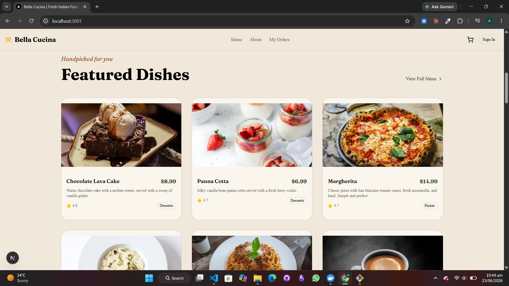

<div align="center">

# 🍽️ Savoria — Restaurant E‑Commerce Platform

### A production-ready, full-stack restaurant ordering experience built with Next.js 16

Browse a beautiful menu, build a cart, check out with Stripe, and track your order in real time — all wrapped in a refined forest‑and‑gold brand experience. Admins manage the menu, orders, and customers from a protected dashboard.

<br />

[](https://nextjs.org/)
[](https://react.dev/)
[](https://www.typescriptlang.org/)
[](https://www.prisma.io/)
[](https://stripe.com/)
[](https://tailwindcss.com/)

</div>

---

## ✨ Featured Dishes

<div align="center">



*A curated selection from the Savoria menu — fresh, seasonal, and ready to order.*

</div>

---

## 🌟 Highlights

- 🛒 **Frictionless ordering** — browse, customize, add to cart, and check out in seconds
- 💳 **Stripe Embedded Checkout** — secure, PCI-compliant payments with webhook-verified order creation
- 📦 **Real-time order tracking** — live status updates from kitchen to doorstep
- 🔐 **Role-based access** — Clerk auth with a protected admin dashboard
- 🎨 **Refined brand experience** — a polished forest/gold theme, fully responsive and accessible
- ⚡ **Built for production** — SSR/ISR, type-safe data layer, SEO, loading states, and error boundaries
- 📧 **Order confirmation emails** — transactional email via Resend
- 🖼️ **CDN-delivered imagery** — food images on Vercel Blob with Next.js `<Image>` optimization

---

## 🧱 Tech Stack

| Layer | Technology | Notes |
|---|---|---|
| **Framework** | Next.js 16 (App Router) | Full-stack, SSR/ISR, file-based routing |
| **Language** | TypeScript (strict) | No `any` — fully type-safe |
| **Styling** | Tailwind CSS 4 + shadcn/ui | Utility-first + accessible primitives |
| **Database** | Neon PostgreSQL | Serverless Postgres via Vercel Marketplace |
| **ORM** | Prisma 7 | Type-safe queries, migrations, Neon adapter |
| **Auth** | Clerk | Sessions, OAuth, role metadata |
| **Payments** | Stripe | Embedded checkout + webhooks |
| **Image Storage** | Vercel Blob | Food images, CDN delivery |
| **Cart State** | Zustand | Client cart, persisted to localStorage |
| **Email** | Resend | Order confirmation emails |
| **Animation** | Framer Motion | Page transitions & micro-interactions |
| **Deployment** | Vercel | Zero-config, edge network |

---

## 🚀 Getting Started

### Prerequisites

- **Node.js 20+**
- A **Neon PostgreSQL** database
- **Clerk**, **Stripe**, **Vercel Blob**, and **Resend** accounts

### 1. Clone & install

```bash
git clone <your-repo-url>
cd ecommerce
npm install
```

### 2. Configure environment

Create a `.env.local` in the project root:

```env
# Neon PostgreSQL
DATABASE_URL=

# Clerk Auth
NEXT_PUBLIC_CLERK_PUBLISHABLE_KEY=
CLERK_SECRET_KEY=
NEXT_PUBLIC_CLERK_SIGN_IN_URL=/sign-in
NEXT_PUBLIC_CLERK_SIGN_UP_URL=/sign-up
NEXT_PUBLIC_CLERK_AFTER_SIGN_IN_URL=/
NEXT_PUBLIC_CLERK_AFTER_SIGN_UP_URL=/

# Stripe
STRIPE_SECRET_KEY=
NEXT_PUBLIC_STRIPE_PUBLISHABLE_KEY=
STRIPE_WEBHOOK_SECRET=

# Vercel Blob
BLOB_READ_WRITE_TOKEN=

# Resend
RESEND_API_KEY=

# App
NEXT_PUBLIC_APP_URL=http://localhost:3000
```

### 3. Set up the database

```bash
npx prisma migrate dev    # apply migrations
npm run seed              # seed demo categories & menu items
```

### 4. Run the dev server

```bash
npm run dev
```

Open **[http://localhost:3000](http://localhost:3000)** 🎉

---

## 🗂️ Project Structure

```
/app
  (customer)/          → Home, Menu, Cart, Checkout, Orders, Account, About
  (admin)/             → Dashboard, Menu CRUD, Orders, Customers, Settings
  api/                 → Stripe webhook, Orders & Menu routes
/components
  ui/                  → shadcn/ui primitives (do not edit)
  menu/ cart/ checkout/ admin/   → feature components
/lib
  db.ts                → Prisma client singleton
  stripe.ts            → Stripe client + helpers
  auth.ts              → Clerk server-side helpers
  blob.ts              → Vercel Blob upload helper
/store
  cartStore.ts         → Zustand cart store (localStorage persisted)
/prisma
  schema.prisma        → Database schema
  seed.ts              → Demo data seeder
```

---

## 🔄 Customer Journey

```
Browse Menu  →  Customize & Add to Cart  →  Stripe Checkout
      ↓                                            ↓
  Real-time  ←  Order Confirmation Email  ←  Webhook creates Order
  Tracking        (Resend)                      (signature verified)
```

---

## 🛠️ Common Commands

```bash
# Development
npm run dev                          # Start dev server at localhost:3000
npm run build                        # Production build
npm run lint                         # ESLint

# Database
npx prisma migrate dev --name <name> # Create & apply a migration
npx prisma studio                    # Visual DB browser
npx prisma generate                  # Regenerate Prisma client
npm run seed                         # Seed demo data

# Type checking
npx tsc --noEmit                     # Type check without emitting
```

---

## ✅ Feature Checklist

- [x] **Menu & browsing** — categories, search, filters, dish detail pages
- [x] **Cart & checkout** — Zustand cart, Stripe Embedded Checkout, webhook order creation
- [x] **Order tracking** — order history + live status polling
- [x] **Accounts** — Clerk auth, profiles, saved addresses
- [x] **Reviews & ratings** — customer feedback on menu items
- [x] **Admin dashboard** — stats, menu CRUD with image uploads, order management, settings
- [x] **Polish** — mobile responsive, SEO, sitemap, loading skeletons, error boundaries, 404

---

## 🔒 Conventions & Guardrails

- **Server Components by default** — `"use client"` only when truly needed
- **Strict TypeScript** — no `any`, data fetched server-side via Prisma
- **Single Prisma client** — always import from `lib/db.ts`
- **Verified webhooks** — Stripe signatures validated with `STRIPE_WEBHOOK_SECRET`
- **Server-side authorization** — admin role checked server-side, never trusted from the client
- **Optimized images** — Next.js `<Image>` only; food images stored on Vercel Blob

---

## ☁️ Deployment

Deploy to **Vercel** with zero config:

1. Push to GitHub and import the repo into Vercel
2. Add all environment variables in the Vercel dashboard
3. Add your production Stripe webhook endpoint → `/api/webhooks/stripe`
4. Deploy 🚀

---

<div align="center">

**Built with ❤️ using Next.js, Prisma, Stripe, and Clerk.**

*A real, deployable product — crafted for production quality at every layer.*

</div>
